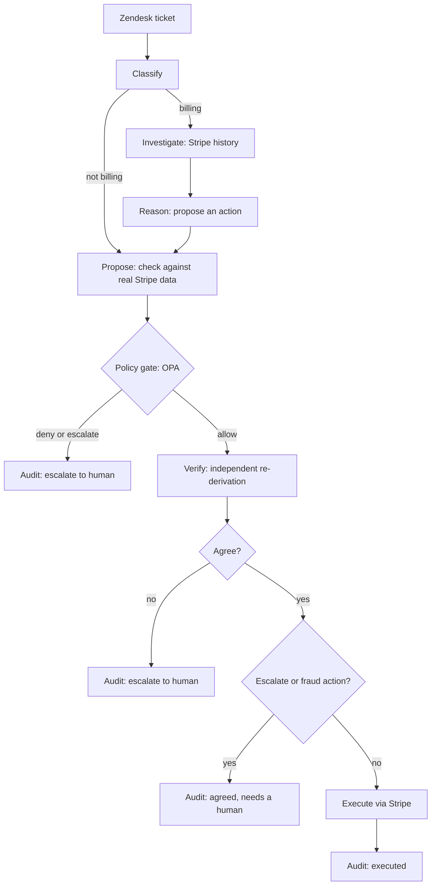

# Backstop

Backstop resolves billing support tickets automatically when it is safe to, and hands them to a human the moment it is not.

A customer writes in (through Zendesk). A worker agent reads the ticket, checks the customer's real Stripe history, and proposes an action such as a refund. A policy engine and a second, independent agent then have to agree before any money moves. Anything risky, ambiguous or over a limit goes to a person in Slack, who can answer in plain English.

**The story.** Loopline is a fictional SaaS company, the demo customer. One of its customers, Jordan, sees the same $45 charge twice and uses Loopline's "Contact support" form. Without Backstop, a support agent would look up the charges in Stripe, decide, refund and reply, for every ticket like it. With Backstop, the form creates a Zendesk ticket, Backstop checks Jordan's real Stripe history, and if the case is clear and inside the limits it refunds the duplicate and replies, usually within a minute. If the case is risky or unclear, such as a fraud flag, a refund over $200 or a disputed charge, it posts to the team's Slack and waits. The person does not need to open Zendesk or Stripe or dig up the ticket and the charge. They reply in that Slack thread with a plain-English command, for example `@Backstop refund $150 of this charge` or `@Backstop close this and tell the customer we could not find their payment`. The agent finds the ticket and the charge itself, checks the command against the same policy rules, carries it out, and answers the customer on the Zendesk ticket.

Everything runs on AWS: Step Functions orchestrates the pipeline, Lambda runs each step, DynamoDB stores every ticket and audit record, and the control room UI is hosted on Amplify.

- Control room: https://main.df09uw95g1goj.amplifyapp.com
- Customer-side demo form (Loopline): https://main.df09uw95g1goj.amplifyapp.com/loopline

## Table of contents

- [Demo video](#demo-video)
- [The problem](#the-problem)
- [How a ticket flows](#how-a-ticket-flows)
- [Safety design](#safety-design)
- [Human in the loop](#human-in-the-loop)
- [Try it](#try-it)
- [Architecture on AWS](#architecture-on-aws)
- [Repository layout](#repository-layout)
- [Run it yourself](#run-it-yourself)
- [Testing](#testing)
- [Known limits](#known-limits)

## Demo video

[](https://www.youtube.com/watch?v=-WIO-fzk5ig)

[Watch on YouTube](https://www.youtube.com/watch?v=-WIO-fzk5ig)

## The problem

Refund and billing tickets are repetitive, but the decisions carry real money. Handling them by hand is slow and inconsistent. Handing them to a single AI is fast but unsafe: a model can invent a charge that does not exist, misread a case, or be talked into a refund it should not give.

Backstop is built around one idea: the AI proposes, but it never gets the last word. Safety comes from the structure around the model, not from trusting the model.

## How a ticket flows



Every terminal step posts to Slack (one thread per ticket), updates the Zendesk ticket, and writes to the audit trail shown in the control room. A ticket usually finishes in under a minute after the poller picks it up.

A person's reply in Slack runs through a second, shorter state machine: parse the command, run the same policy gate, then execute, block, or ask for clarification.

## Safety design

These are the parts that make automatic resolution safe. Each one is enforced in code. The policy rules are covered by the Rego test suite, and the rest were exercised end to end on AWS (see [Testing](#testing)).

1. **Hallucination guard.** An action proposed by the model must reference a charge or subscription that actually appears in the customer's Stripe history. Otherwise it is downgraded to an escalation before anything else happens.
2. **Deny rules the model cannot override.** Policy lives in [Open Policy Agent](https://www.openpolicyagent.org/) (Rego), separate from the AI. Deny beats escalate beats allow. Current limits: a single refund may not exceed $200, at most 3 refunds per customer per month, account credit is capped at $200, disputed charges and blocked or fraud-flagged customers are refused, and fraud reviews and low-confidence decisions always go to a human.
3. **An independent verifier.** A second agent re-pulls the customer's Stripe data itself and reaches its own conclusion. It never sees the worker's reasoning, and the two are compared on structured fields only (action type, amount, target charge or subscription). If they disagree, or the verifier's confidence is low, a human decides. The verifier uses a different model from the worker, because a second call to the same model is not real independence.
4. **A never-auto-execute gate.** Even when both agents agree, an agreed `escalate` or fraud action is never executed. It is routed to a human. This rule lives in the state machine, not in the verifier.
5. **Idempotent execution.** Stripe calls use an idempotency key derived from the ticket ID (for example `backstop-refund-<ticket id>`), so a retried Step Functions execution cannot refund twice.
6. **Humans go through the same gate.** A person's plain-English command in Slack is parsed into a structured action (temperature 0) and checked by the same policy engine. A deny still blocks a human. An escalation does not, because a person asking is itself the resolution.

## Human in the loop

- **Slack.** Each ticket gets one thread in the alerts channel. Reply in that thread with `@Backstop <plain English>`. Only allow-listed Slack users can issue commands. The parser turns your words into an action, OPA checks it, and the result is posted back in the thread.
- **Control room.** A live view of every ticket with the worker's and the verifier's reasoning side by side, the policy decision, a link to the Zendesk ticket, and the full audit trail. Signing in with Slack sets your role: viewers can read, approvers can approve, override or hold a flagged ticket, and admins can also trigger an immediate Zendesk sync. Signed-out guests can look but never act, when guest mode is on.

## Try it

The live demo needs no setup.

1. Open [Loopline](https://main.df09uw95g1goj.amplifyapp.com/loopline) and fill in a name, an email and a message.
2. Submit. Loopline creates a real Zendesk ticket and shows its request number.
3. Within about a minute the poller picks it up. The ticket appears in the control room and a thread opens in the Slack alerts channel.
4. Open the ticket in the control room to see the worker and verifier reasoning side by side, the policy decision, the audit trail, and the "Open in Zendesk" link.

The demo customers live in the author's Stripe test account, so use the email in the second column and the pipeline will find a matching customer. The model makes the decisions, so wording can vary, but these are the outcomes that were recorded on AWS.

| What it shows                        | Email                                  | Message                                                                                                                                                    | Expected result                                                                                      |
| ------------------------------------ | -------------------------------------- | ---------------------------------------------------------------------------------------------------------------------------------------------------------- | ---------------------------------------------------------------------------------------------------- |
| A question that is not about billing | `nobill-demo-1@backstop-demo.test`     | Hi, how do I reset my password? I cannot find the option anywhere in the settings page.                                                                    | Classified as not billing and resolved with no action. No Stripe lookup.                             |
| A fraud-flagged account              | `fraud-flag-demo-1@backstop-demo.test` | Hi, I would like a refund for the $55.00 charge on my account, we no longer use the service. Thanks.                                                       | Policy denies it (`blocked_patterns.fraud_flag`), Slack shows "Blocked by policy", nothing executes. |
| A customer Stripe cannot find        | `newuser-demo-1@backstop-demo.test`    | Hi, I paid $60.00 last week for the Pro plan, but I signed up with my personal email and my account here uses this work email. Please refund that payment. | Worker and verifier both say escalate, and the never-auto-execute gate sends it to a human.          |

Also run on AWS: an automatic duplicate-charge refund, a $250 refund blocked by policy and then approved down to $150 by a human in Slack, a proration explained with no refund, a stolen-card claim, a disputed charge, and a subscription cancellation. Those use up their Stripe test data, so the three above are the repeatable ones.

To try the human side, reply in the Slack thread under any ticket, for example `@Backstop refund $150 of this charge`, or `@Backstop close this with no action and tell the customer: we could not find a payment under this email`. A command that names no concrete action, such as `@Backstop tell the user the issue`, gets a "Command needs clarification" reply, because the parser will not invent what to do or what to tell a customer.

## Architecture on AWS

| Concern                | Service                                                                                                                   |
| ---------------------- | ------------------------------------------------------------------------------------------------------------------------- |
| Orchestration          | AWS Step Functions: a main pipeline and a command pipeline (definitions in [statemachines/](statemachines/))              |
| Compute                | AWS Lambda (Python 3.12, arm64), 16 functions                                                                             |
| Policy engine          | OPA binary packaged as a Lambda layer, called with `opa eval`                                                             |
| Storage                | Amazon DynamoDB, single table with four global secondary indexes                                                          |
| Ticket polling         | Amazon EventBridge schedule, once a minute, polling four times per run (EventBridge cannot schedule faster than a minute) |
| HTTP endpoints         | Amazon API Gateway (HTTP API): Zendesk OAuth, ticket submission, Slack events                                             |
| UI hosting             | AWS Amplify Hosting (Next.js)                                                                                             |
| Observability          | CloudWatch Logs per function, and the Step Functions execution history for every ticket run                               |
| Infrastructure as code | AWS SAM ([template.yaml](template.yaml))                                                                                  |

External services: Zendesk (tickets), Stripe (payments, test mode), Slack (notifications, commands and sign-in), and an LLM provider.

**LLM provider.** The model client sits behind one interface with three implementations, selected by the `LLM_CLIENT` setting: `gemini` (used in the deployed demo), `bedrock` (Amazon Bedrock Converse API with schema-forced output) and `mock` (fixtures for local testing). The deployed stack uses Gemini because Bedrock model access was not available on the account during the hackathon. The Bedrock path is implemented and was exercised with a mocked client during development, but it has not been run against live Bedrock. Each provider has a smaller model for the worker and a different, stronger one for the verifier.

**Data model.** One DynamoDB table holds tickets, policy decisions, verification results and the append-only audit trail, keyed by ticket. Four indexes serve the queries the UI needs: by status, all tickets by time, by Zendesk ID (ingestion de-duplication), and by entity and date.

## Repository layout

| Path              | Purpose                                                               |
| ----------------- | --------------------------------------------------------------------- |
| `worker_agent/`   | Classify, investigate, reason and propose steps, plus the LLM clients |
| `verifier_agent/` | The independent verifier                                              |
| `governance/`     | Rego policies, policy tests, the OPA client and the Lambda layer      |
| `execution/`      | Stripe execution with idempotency                                     |
| `command_agent/`  | Plain-English command parsing and its pipeline                        |
| `audit/`          | Slack and Zendesk notifications, the Slack events endpoint            |
| `ingestion/`      | Zendesk poller, OAuth, ticket submission                              |
| `persistence/`    | DynamoDB access layer and table creation                              |
| `shared/`         | Shared data models, action types and Zendesk auth                     |
| `statemachines/`  | Step Functions definitions                                            |
| `ui/`             | The Next.js control room and the Loopline demo form                   |
| `template.yaml`   | The SAM template for everything above                                 |

## Run it yourself

Prerequisites: an AWS account with CLI credentials, the AWS SAM CLI, and `python3` with `pip` and `rsync` on the PATH.

```bash
bash governance/layer/build_layer.sh   # downloads the OPA binary for the Lambda layer (Linux arm64)
sam build
sam deploy --parameter-overrides "Stage=dev LlmClient=gemini GeminiApiKey=... StripeApiKey=..."
```

Then connect Zendesk (an OAuth client with the redirect URL `<HttpApiUrl>/oauth/callback`, then open `<HttpApiUrl>/oauth/authorize` once) and Slack (a bot with the `chat:write` and `app_mentions:read` scopes, invited to the alerts channel, with Event Subscriptions pointing at `<HttpApiUrl>/slack/events` for the `app_mention` event). `HttpApiUrl` is printed when the deploy finishes. Every parameter is documented in [template.yaml](template.yaml), and `sam deploy` resets any you leave out, so pass every secret on each deploy. The UI is a Next.js app in `ui/` that deploys to Amplify Hosting, and its settings are listed in [ui/.env.example](ui/.env.example).

## Testing

- **Policy rules.** `opa test governance/` runs 15 tests covering the refund limits, the account credit cap, blocked and fraud-flagged customers, disputed charges, low-confidence intent, repeat customers, high-value transactions, unknown action types, fraud review, and the rule that deny beats escalate.
- **The whole system, on AWS.** The scenarios above were run against the deployed stack and are visible in the control room's audit trail.
- **Not covered.** There is no CI and no automated test suite for the handlers or the UI (the handlers were exercised by hand against LocalStack during development), and the Bedrock path has never been run against live Bedrock.

## Known limits

- **Model provider outages.** Step Functions retries Lambda infrastructure errors and the model client retries transient API errors, but a function that times out or raises is not retried. A long provider outage can leave a ticket unfinished.
- **Secrets.** Keys are stack parameters marked `NoEcho`, and they end up as Lambda environment variables that anyone with access to the function configuration can read. Zendesk OAuth tokens are stored in the DynamoDB table, and Bedrock access is not scoped to specific models. A production setup would use Secrets Manager.
- **Unauthenticated ingest routes.** The `/ingest/*` endpoints have no authentication, as in the original design. They are meant to sit behind the demo, not to face the open internet.
- **Two writes instead of a transaction.** Recording a proposed action and its audit record are two sequential writes, because LocalStack's DynamoDB did not support the transaction API reliably. On real AWS this can become one transaction.
- **Demo customers use `.test` email domains**, so Zendesk cannot deliver mail to them and shows a delivery failure on the ticket.
- **All payments are in Stripe test mode.** No real money moves.
