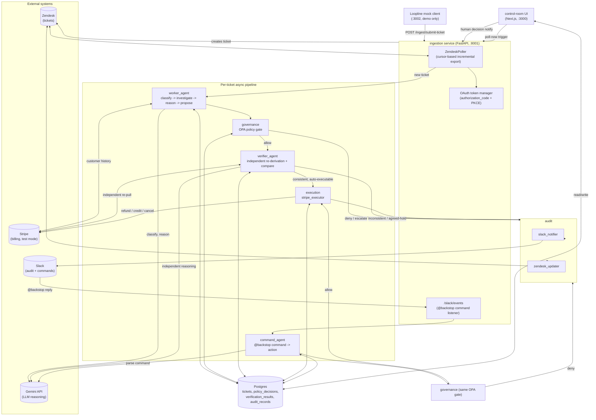
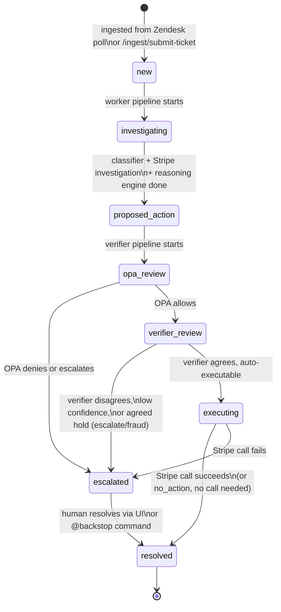

# Backstop

Backstop is an autonomous billing-support agent. It reads incoming customer
support tickets, investigates the customer's real Stripe billing history,
decides what to do about it, checks that decision against a written policy
engine, has a second independent agent verify the first agent's conclusion,
and only then executes a real action (refund, credit, cancellation) or hands
the ticket to a human. Every step is logged, posted to Slack, and visible in
a live control-room UI. A human can also resolve a ticket directly, by typing
a plain-English instruction in the Slack thread.

The core idea: a single LLM call proposing "refund this customer" is not
something you can safely wire straight to a payments API. Backstop's answer
is a pipeline where no single component is trusted to move money on its own:
governance (deterministic policy) and verification (an independently-reasoning
second agent) both have to agree before Stripe is touched.

## Table of contents

- [Architecture](#architecture)
- [Ticket lifecycle](#ticket-lifecycle)
- [Modules](#modules)
  - [shared](#shared)
  - [ingestion](#ingestion)
  - [worker_agent](#worker_agent)
  - [governance](#governance)
  - [verifier_agent](#verifier_agent)
  - [execution](#execution)
  - [audit](#audit)
  - [command_agent](#command_agent)
  - [persistence](#persistence)
  - [ui](#ui-control-room)
  - [mock-client](#mock-client-loopline)
  - [test_tickets](#test_tickets)
  - [run_eval.py](#run_evalpy)
- [Governance policy reference](#governance-policy-reference)
- [Running it locally](#running-it-locally)
- [Known limitations](#known-limitations)

## Architecture

Three long-running services, one shared Postgres database, and two external
systems of record (Zendesk for tickets, Stripe for money).



**Design invariant: single OAuth owner.** Only the ingestion service holds the
Zendesk OAuth token manager. The UI and mock-client never call Zendesk
directly: the UI's Stripe/Postgres writes for a human decision are followed
by a call to ingestion's `/ingest/human-decision-notify`, which does the
actual Slack post and Zendesk write-back. This avoids a refresh-token
rotation race between two independent token holders.

## Ticket lifecycle

Every ticket moves through a `status` column on the `tickets` table as it's
processed. This is what the UI's pipeline track visualizes.



Both the automated pipeline and the `@backstop` human-command pipeline
converge on the same OPA gate and the same `execution.stripe_executor`. The
only real difference: the command pipeline skips the verifier's
independent re-derivation (there's nothing left to re-derive against once a
human has stated the action explicitly), while an `escalate` from OPA still
blocks a human command just like it blocks the worker's.

## Modules

### shared

Cross-cutting Pydantic models and the Zendesk OAuth client, imported by
every other Python module.

- [`shared/models.py`](shared/models.py): the Pydantic schemas that flow
  between every stage: `Classification`, `StripeHistory` (with `Transaction`
  and `Subscription`), `ProposedAction`, `VerificationResult`. `ProposedAction`
  is the one structure both the worker, the verifier, and the human-command
  pipeline all produce, so all three can flow through the identical OPA gate
  and executor.
- [`shared/action_types.py`](shared/action_types.py): single source of truth
  for the seven valid `action_type` strings (`refund`, `partial_refund`,
  `no_action`, `escalate`, `cancel_subscription`, `apply_account_credit`,
  `flag_for_fraud_review`), kept in sync with `shared/models.py`'s `ActionType`
  literal and `governance/data/policy_data.json`'s `known_action_types`.
- [`shared/zendesk_auth.py`](shared/zendesk_auth.py): the shared Zendesk
  OAuth 2.0 token manager (authorization_code + PKCE grant, not a static API
  token or client_credentials). Persists the access/refresh token pair to a
  local `.zendesk_oauth_cache.json` file so a service restart doesn't force
  re-authorization. `authed_request()` wraps any Zendesk call with automatic
  401-triggered refresh.

### ingestion

FastAPI service (port 8001): the only process that talks to Zendesk.

- [`ingestion/zendesk_webhook.py`](ingestion/zendesk_webhook.py): despite
  the filename, this is a **poller**, not a webhook receiver (no public
  tunnel needed for a demo). `ZendeskPoller` uses Zendesk's cursor-based
  incremental ticket export, draining every available page each cycle (every
  15s by default) so a backlog doesn't wait multiple poll intervals to clear.
  Deleted tickets are filtered out (Zendesk's incremental export reports a
  deletion as an "update," and without the filter the poller would reprocess
  old deleted tickets, including issuing real Stripe actions against them,
  a real bug found and fixed during manual testing). Each new ticket is
  persisted, then dispatched as its own detached `asyncio` task running
  `worker_agent.pipeline` followed by `verifier_agent.pipeline`, so tickets
  process concurrently rather than one at a time.
  - `GET /health`: reports Zendesk configuration/authorization status.
  - `GET /oauth/authorize`, `GET /oauth/callback`: one-time browser OAuth
    flow to grant Zendesk access (or re-grant if the cached refresh token is
    revoked).
  - `POST /ingest/submit-ticket`: creates a real Zendesk ticket from a
    `{name, email, message}` payload; used by the Loopline mock client's
    "Contact support" widget. The normal poller picks the new ticket up.
  - `POST /ingest/poll-now`: manual trigger for demos, bypasses the poll
    timer.
  - `POST /ingest/human-decision-notify`: the UI's approve/override/
    acknowledge actions call this after writing to Postgres/Stripe directly,
    so the actual Slack post and Zendesk write-back still go through the one
    process holding the shared OAuth token manager.
  - Also mounts `audit.slack_commands`'s router for the `/slack/events`
    endpoint (see [command_agent](#command_agent)).

### worker_agent

The first agent: reads a ticket, investigates, reasons, and proposes an
action. Orchestrated by [`worker_agent/pipeline.py`](worker_agent/pipeline.py):
`classify -> investigate -> reason -> propose`, with `_run_full_pipeline`
awaited at every stage so other tickets' pipelines keep making progress on
the same event loop.

- [`worker_agent/classifier.py`](worker_agent/classifier.py): fast first
  pass over the raw ticket text only (no Stripe call yet). Produces
  `is_billing_relevant`, `intent` (one of six categories), `urgency`, and a
  confidence score. A non-billing ticket (e.g. a product bug report) short-
  circuits the pipeline straight to a `no_action` `ProposedAction`, skipping
  the expensive Stripe investigation and reasoning stages entirely.
- [`worker_agent/stripe_investigator.py`](worker_agent/stripe_investigator.py):
  pulls ground-truth billing history from Stripe. Matches the ticket's
  requester email to a Stripe customer, then fetches charges, invoices, and
  subscriptions concurrently. Cross-references invoice line items against
  charges (via `payment_intent`) to flag which charges are legitimate
  **proration** adjustments rather than surprise duplicate charges: this is
  the data that lets the reasoning engine recognize a real subscription
  upgrade proration instead of assuming every unexpected charge is an error.
  Returns an empty-but-valid `StripeHistory` (not an exception) when no
  Stripe customer matches the email: that's a meaningful result the
  reasoning engine acts on, not a failure.
- [`worker_agent/reasoning_engine.py`](worker_agent/reasoning_engine.py):
  the actual judgment call, via Gemini. Reconciles the customer's ticket
  text against the real Stripe history. Encodes the pipeline's core safety
  rules directly in the prompt: fraud/theft language always routes to
  `flag_for_fraud_review` (never plain `escalate`, regardless of how little
  billing history exists); a proration charge may be legitimate even if it
  reads like a surprise charge; a refund or cancellation must target an id
  that actually exists in the provided Stripe data (never invented); missing
  billing history (and no fraud signal) means `escalate`, not a guess. When
  the outcome is `no_action` and real billing history was investigated, the
  model also writes a grounded `customer_message` explaining *why* nothing
  is happening (e.g. "these are two separate charges..."), so the customer
  gets a genuine explanation instead of a generic template string.
- [`worker_agent/action_proposer.py`](worker_agent/action_proposer.py): the
  guardrail between "what the LLM said" and "what gets persisted." Validates
  the reasoning engine's claim against the real `StripeHistory` it was given:
  a refund/partial_refund must target a transaction id that actually exists,
  the amount can't exceed the remaining refundable amount, a
  `cancel_subscription` must target a real subscription id, and
  `apply_account_credit` requires a real Stripe customer. Any violation
  **downgrades the action to `escalate`** rather than persisting a
  hallucinated action: this is the hallucination safety net inside the
  worker's own pipeline, independent of the OPA/verifier gates that come
  after it. Persists the (possibly downgraded) `ProposedAction` to the
  ticket row and logs both the original and downgraded versions to the audit
  trail.
- [`worker_agent/gemini_client.py`](worker_agent/gemini_client.py): shared
  REST client for Gemini's `generateContent` with a JSON response schema.
  Retries on transient errors (429/500/502/503/504) with backoff, up to 5
  attempts. `CLASSIFIER_MODEL` and `REASONING_MODEL` (used by the worker's
  classifier and reasoning engine) default to `gemini-flash-lite-latest`;
  `VERIFIER_MODEL` (used only by the verifier's cross-reference engine)
  defaults to the full `gemini-flash-latest` tier, so the verifier is a
  genuinely different model from the worker, not a second call to the same
  one. `-latest` aliases are used deliberately instead of dated pins, so the
  model doesn't disappear from under a running API key. Accepts an optional
  `temperature` override (used by the command parser for deterministic
  transcription).

### governance

The deterministic policy gate every proposed action must clear before the
verifier or executor ever sees it, written in [Open Policy Agent](https://www.openpolicyagent.org/)'s
Rego language and evaluated by shelling out to the `opa` CLI.

- [`governance/opa_client.py`](governance/opa_client.py): assembles the
  `input` document OPA's rules expect (`action`, `customer`, `transaction`,
  `subscription`) from a `ProposedAction` plus Stripe/ticket context, then
  runs `opa eval` as an async subprocess (so it yields to the event loop
  rather than blocking other tickets). Returns the `{decision, matched_rule,
  reason, all_matched_rules}` result.
- [`governance/main.rego`](governance/main.rego): combines the three policy
  modules below with a fixed precedence: **deny** (hard violation) beats
  **escalate** (soft flag) beats the default **allow**. Only `allow`
  continues to the verifier; both `deny` and `escalate` route straight to a
  human, without ever reaching the second agent.
- [`governance/policies/blocked_patterns.rego`](governance/policies/blocked_patterns.rego):
  hard blocks, a customer on the blocked-customer list, a refund/partial
  refund against a transaction under active dispute/chargeback, or a
  customer with an active fraud flag (blocks *everything* for that customer,
  a deliberate strict choice, not just refunds).
- [`governance/policies/refund_limits.rego`](governance/policies/refund_limits.rego):
  hard limits, max single refund amount (per currency), max refunds per
  customer per rolling 30 days, and the equivalent cap applied to
  `apply_account_credit`.
- [`governance/policies/escalation_rules.rego`](governance/policies/escalation_rules.rego):
  soft flags that route to a human without being a hard violation: worker
  confidence below threshold ("ambiguous intent"), a repeat customer (3+
  tickets in 90 days), a high-value transaction (per currency), an
  unrecognized `action_type` (fail-safe: policy silence never means silent
  allow), and, categorically and regardless of confidence, any
  `flag_for_fraud_review` action.
- [`governance/data/policy_data.json`](governance/data/policy_data.json):
  the actual numeric knobs referenced by all three policy modules above:
  refund/credit limits per currency (USD/EUR/GBP only: an unlisted currency
  silently passes amount checks, since a Rego lookup on a missing map key is
  undefined rather than an error), escalation thresholds, and the blocked
  customer id list.
- [`governance/policy_test.rego`](governance/policy_test.rego): the OPA
  unit test suite (`opa test governance/ -v`), 15 test cases covering every
  rule above.

### verifier_agent

The second, independent agent. Never sees the worker's conclusion or
rationale: it re-derives an answer from scratch and the two are compared
structurally.

- [`verifier_agent/cross_reference.py`](verifier_agent/cross_reference.py):
  re-reads the ticket text fresh from Postgres and re-pulls Stripe history
  fresh (a brand-new API call, not whatever the worker's pipeline had in
  memory), then runs an independent Gemini call with a system prompt that
  explicitly tells the model it has not seen and will not be shown any other
  agent's conclusion. Encodes the same safety rules as the worker's reasoning
  engine (fraud-first, proration awareness, no invented ids), plus the
  customer's recent ticket count as contextual signal. Also exposes
  `count_recent_tickets()`, shared by the OPA input assembly and the
  command-agent pipeline for the "repeat customer" signal.
- [`verifier_agent/consistency_checker.py`](verifier_agent/consistency_checker.py): compares the worker's `ProposedAction` against the verifier's
  independently-derived one on **structured fields only**
  (`action_type`, `amount`, `target_transaction_id`,
  `target_subscription_id`): never the prose rationale, since two valid
  explanations can differ in wording while agreeing on the actual decision.
  Also enforces a confidence floor: even a field-for-field match is not
  "consistent" if the verifier's own confidence is below 0.6, since a low-
  confidence agreement is still a shaky signal to auto-execute on.
- [`verifier_agent/pipeline.py`](verifier_agent/pipeline.py): the
  orchestrator for the whole post-worker chain: builds and evaluates the OPA
  input, persists the `PolicyDecision`; on `allow`, runs
  `cross_reference` + `check_consistency`, persists the `VerificationResult`;
  routes to `execution.execute_action` only if the two agents are
  structurally consistent **and** the agreed action isn't itself one that
  always needs a human (`escalate` or `flag_for_fraud_review`: agreeing on
  one of these means "we agree a human must handle this," never "safe to
  auto-execute"). Every other branch (OPA deny/escalate, verifier mismatch,
  agreed-hold) posts to Slack and writes an internal note back to Zendesk.

### execution

The only module with permission to actually move money.

- [`execution/stripe_executor.py`](execution/stripe_executor.py): fires
  only after both OPA and the verifier have cleared the action, and trusts
  that gate completely (it does not re-derive or re-check anything itself).
  Every Stripe write uses an `Idempotency-Key` derived from the ticket id, so
  a retried execution can never double-refund/double-credit/double-cancel.
  Dispatches per `action_type`: `refund`/`partial_refund` (POST
  `/refunds`), `cancel_subscription` (DELETE `/subscriptions/{id}`),
  `apply_account_credit` (a negative `balance_transactions` entry, credits
  future invoices rather than moving money directly), and `no_action`
  (resolves directly with no Stripe call). Any Stripe HTTP error, or an
  action reaching execution with a missing target id (a defensive check:
  `action_proposer`'s hallucination guard should already have caught this),
  escalates rather than silently marking the ticket resolved.
  `customer_facing_resolution_message()` builds the public Zendesk comment
  for each outcome: a human `@backstop` command's `customer_message` always
  wins when present; otherwise a distinct, specific default per
  `action_type`: notably `flag_for_fraud_review` gets its own message that
  never confirms or denies anything about the underlying claim (a generic
  "no action needed" message would be actively misleading for what's still a
  pending security review), and a `no_action` outcome uses the reasoning
  engine's own grounded `customer_message` when one was set.

### audit

The write side of the audit trail: Slack notifications and Zendesk
write-back, plus the human-in-the-loop Slack command listener.

- [`audit/slack_notifier.py`](audit/slack_notifier.py): posts a
  human-readable reasoning trail (not a raw JSON dump) to Slack via
  `chat.postMessage` (not an incoming webhook: a webhook never returns a
  message `ts` to thread under). The first post for a ticket opens a thread;
  every subsequent post for that ticket replies into it, so the whole
  decision history for one ticket reads as one conversation. Distinct
  message types: blocked (by policy), escalated (verifier disagreement or
  agreed-hold), executed, execution failed, command blocked, and command
  needs clarification.
- [`audit/zendesk_updater.py`](audit/zendesk_updater.py): writes the final
  decision back to the original ticket. Executed maps to `solved` status with a
  public customer-facing comment. Escalated/blocked/failed maps to `open` status
  (not `pending`, which would imply Backstop is waiting on the *customer*)
  with an internal-only note. Uses the shared `token_manager`, never its own
  token state, to avoid a refresh-token race with the ingestion poller.
- [`audit/slack_commands.py`](audit/slack_commands.py): the Slack Events
  API listener backing the `@backstop <command>` feature. Verifies Slack's
  request signature (HMAC-SHA256 over `v0:{timestamp}:{body}`) and rejects
  anything older than 5 minutes. De-dupes Slack's `event_id` in-memory
  (Slack can redeliver the same event). Only reacts to **threaded**,
  non-bot messages that mention the bot; resolves the thread back to a
  ticket via `slack_thread_ts`; checks the sending user against an
  allowlist (`SLACK_COMMAND_ALLOWED_USER_IDS`) so a compromised Slack
  integration can't trigger a real Stripe action; then dispatches
  `command_agent.pipeline.run_command_pipeline` as a fire-and-forget task
  (Slack needs its 200 response well before a Gemini+Stripe+OPA round trip
  could finish).

### command_agent

The second way an action reaches execution: a human typing a plain-English
instruction in the Slack thread under a ticket, instead of the automated
worker pipeline.

- [`command_agent/command_parser.py`](command_agent/command_parser.py):
  turns free text (e.g. "refund the last charge", "cancel their
  subscription", "let them know this was a legitimate proration") into the
  same `ProposedAction` shape the worker agent produces. The system prompt
  frames this explicitly as **transcription**, not judgment: the human has
  already reviewed the ticket's full audit trail and made the call, so the
  model's job is to ground their instruction against the real Stripe data
  (resolve "the last charge" to an actual transaction id, cap a refund at
  the real remaining refundable amount) and structure it, not to
  second-guess whether the underlying complaint was valid. Runs at
  `temperature=0`, unlike every other reasoning call in the codebase: an
  explicit human instruction should transcribe identically every time, not
  vary run to run (this was a real bug found during testing: the same
  command text alternated between `no_action` and `escalate` before the
  temperature fix). A pure "communicate with the customer" instruction (no
  concrete billing action) is a **valid** `no_action` outcome with a
  `customer_message`, not something to reject as vague. Confidence is fixed
  at 1.0 (an explicit instruction isn't a probabilistic inference).
- [`command_agent/pipeline.py`](command_agent/pipeline.py): orchestrates
  the shorter chain: parse -> validate against Stripe (reusing
  `worker_agent.action_proposer.validate_against_stripe`, the same
  hallucination guard the automated path uses) -> OPA. Deliberately skips
  the verifier's independent re-derivation entirely: there's nothing left
  to independently re-derive against once a human has explicitly stated the
  action. A `deny` from OPA still blocks even a human command (policy is not
  overridable by an operator's Slack message); an `escalate` flag, by
  contrast, does **not** block here, since a human is already the approving
  party those flags exist to route to. If the parsed action is itself
  `escalate` or `flag_for_fraud_review` (the command couldn't be grounded in
  a concrete action), the human gets a "needs clarification" reply instead
  of a silent no-op.

### persistence

SQLAlchemy models and session management, shared by every Python module
above.

- [`persistence/models.py`](persistence/models.py): four tables:
  - `Ticket`: one row per Zendesk ticket. Carries `status` (the lifecycle
    enum from the [Ticket lifecycle](#ticket-lifecycle) diagram),
    `classification`/`proposed_action` as JSONB snapshots of the latest
    values, and `slack_channel`/`slack_thread_ts` so later Slack posts and
    `@backstop` command replies resolve back to this ticket.
  - `PolicyDecision`: one row per OPA evaluation, with the full raw
    input/output JSON preserved for audit.
  - `VerificationResult`: one row per verifier run, including the
    verifier's own independently re-pulled Stripe/ticket data.
  - `AuditRecord`: append-only, one row per decision-chain event
    (`ticket_ingested`, `classified`, `stripe_investigated`, `reasoned`,
    `proposed_action`, `policy_decision`, `cross_referenced`,
    `verification_result`, `executed`, `execution_failed`,
    `command_received`, `command_parsed`, `command_downgraded`,
    `command_policy_decision`, `human_decision`, ...), tagged with an
    `actor` (`worker_agent` / `opa` / `verifier_agent` / `execution` /
    `human:<slack_user_id>`). This is the data the UI's ticket-detail
    timeline and the Slack thread both render from.
- [`persistence/db.py`](persistence/db.py): SQLAlchemy engine/session
  factory reading `DATABASE_URL` from `.env`.
- [`persistence/init_db.py`](persistence/init_db.py): creates all tables
  from the models above (`Base.metadata.create_all`).

### ui (control room)

Next.js 15 app (port 3000): the live dashboard for watching and
intervening in the pipeline. Talks to Postgres directly for reads and most
writes; for the two actions that must reach Zendesk/Slack (marking a ticket
resolved/escalated), it calls back into the ingestion service so the single
shared OAuth token manager stays the only thing that ever talks to Zendesk.

- [`ui/app/page.tsx`](ui/app/page.tsx): the Tickets list (server component),
  reading `getQueueStats()` and `getTickets()` with URL-driven filters
  (search text, customer id, status bucket, action type, date range,
  pagination). Forces `dynamic = "force-dynamic"` so this stays a live view
  instead of a build-time snapshot.
- [`ui/app/tickets/[id]/page.tsx`](ui/app/tickets/%5Bid%5D/page.tsx): the
  ticket detail page, backed by `getTicketDetail()`.
- [`ui/app/api/tickets/route.ts`](ui/app/api/tickets/route.ts),
  [`ui/app/api/tickets/[id]/route.ts`](ui/app/api/tickets/%5Bid%5D/route.ts),
  [`ui/app/api/stats/route.ts`](ui/app/api/stats/route.ts),
  [`ui/app/api/poll-now/route.ts`](ui/app/api/poll-now/route.ts): the
  client-side API routes the polling hooks and detail-page actions call:
  list/filter tickets, fetch+decide on one ticket, queue stats, and a
  manual "poll now" trigger proxied straight to ingestion.
- [`ui/lib/queries.ts`](ui/lib/queries.ts): all SQL against Postgres via the
  `postgres` client, plus `recordHumanDecision()`: the actual logic behind
  the UI's Approve/Override/Acknowledge buttons. Executes the chosen
  `ProposedAction` directly against Stripe and Postgres (refund, cancel, or
  credit, matching `execution.stripe_executor`'s own branches), then calls
  `notifyHumanDecision()`, a fetch to ingestion's
  `/ingest/human-decision-notify`, so the Slack post and Zendesk write-back
  still happen through the token-manager-owning process.
- [`ui/lib/types.ts`](ui/lib/types.ts): hand-maintained TypeScript mirror of
  `persistence/models.py`; Python/SQLAlchemy remains the schema's source of
  truth.
- [`ui/lib/pipeline.ts`](ui/lib/pipeline.ts): collapses the full
  `TicketStatus` enum down to five visual pipeline stages
  (`investigating -> proposed -> policy_check -> verifying -> executed`) for
  the pipeline-track component, plus `isHold()`/`isDone()` helpers.
- [`ui/lib/stripe.ts`](ui/lib/stripe.ts): the Stripe REST calls
  `recordHumanDecision()` needs (issue refund, cancel subscription, apply
  account credit): a thin TypeScript mirror of what
  `execution/stripe_executor.py` does in Python, used only for the
  human-decision path.
- [`ui/lib/db.ts`](ui/lib/db.ts): the shared `postgres` client instance.
- [`ui/lib/usePolling.ts`](ui/lib/usePolling.ts), `ui/lib/format.ts`,
  `ui/lib/audit.ts`, `ui/lib/utils.ts`: client-side polling hook (keeps the
  live dashboard current without a full page reload), currency/date
  formatting helpers, and small audit-trail/general utilities.
- [`ui/components/`](ui/components): `TicketsListClient`/`TicketsTable`/
  `TicketsFilters`/`Pagination` (the list view), `TicketDetailClient` (the
  detail view: reasoning comparison, policy decision, verification result,
  audit timeline, and the Approve/Override/Acknowledge actions),
  `PipelineTrack` (the five-stage visual pipeline indicator),
  `StatsBar`/`Age`/`LiveClock` (dashboard chrome), `Blueprint`/`Breadcrumb`/
  `app-sidebar`/`site-header` (visual/navigation shell), and `ui/` (a small
  shadcn-style primitive kit: button, input, separator, sheet, sidebar,
  skeleton, tooltip).

### mock-client (Loopline)

A standalone demo site proving the "Backstop is embedded in someone else's
product" story: deliberately kept outside the main Backstop app.

- [`mock-client/server.ts`](mock-client/server.ts): a tiny Bun server
  (port 3002) simulating a fictitious SaaS product, "Loopline," whose users
  hit a normal "Contact support" widget. The one dynamic route,
  `POST /api/submit-ticket`, proxies straight to Backstop's own
  `/ingest/submit-ticket`: Loopline never talks to Zendesk itself, keeping
  the single-OAuth-owner invariant intact even for this outermost demo
  surface. Everything else is a static `index.html` served as-is.

### test_tickets

Fixture provisioning for the three canonical demo scenarios (see
[`test_tickets/README.md`](test_tickets/README.md) for the full walkthrough
and current live ticket numbers).

- [`test_tickets/setup_fixtures.py`](test_tickets/setup_fixtures.py):
  provisions real Stripe test-mode customers/charges/subscriptions and real
  Zendesk tickets for three scenarios: a clean duplicate charge (proves
  full automation, zero human touch), a proration mismatch (the core
  worker-vs-verifier disagreement moment), and a divergence case (two
  same-amount charges that are actually unrelated: proves the system reads
  what a charge *is*, not just its amount and timing). Deliberately not
  idempotent; re-running always creates fresh fixtures.
- [`test_tickets/force_disagreement_fallback.py`](test_tickets/force_disagreement_fallback.py): a documented fallback for scenario 2, in case a live run resolves too
  cleanly to show the disagreement mechanism to an audience. Re-runs
  verification on a real ticket with a deliberately wrong worker action
  substituted in; the verifier still independently re-derives against real
  Stripe data and genuinely disagrees. Never touches Stripe: a mismatch
  always routes to escalation, never execution.

### run_eval.py

A 500+ line programmatic evaluation harness. Runs a fixed set of synthetic
tickets straight through the real `worker_agent -> governance -> verifier_agent
-> execution` chain, the exact functions ingestion dispatches for a live
ticket, and reports what happened at each stage, using fresh disposable
Stripe test-mode customers/charges created by the script itself (never the
reserved `test_tickets/` demo fixtures). Slack notifications and Zendesk
write-back are patched to no-ops for the duration of the run only (in-process,
not on disk), since these eval tickets are Postgres-only and have no real
Zendesk ticket to write back to. Writes its report to `docs/eval_results.md`.
Usage: `uv run python run_eval.py`.

## Governance policy reference

Current values from [`governance/data/policy_data.json`](governance/data/policy_data.json):

| Rule | Limit |
|---|---|
| Max single refund | $200 USD / €180 EUR / £160 GBP |
| Max single account credit | $200 USD / €180 EUR / £160 GBP |
| Max refunds per customer per 30 days | 3 |
| Ambiguous-intent confidence threshold | 0.6 |
| Repeat-customer ticket threshold | 3 tickets / 90 days |
| High-value transaction threshold | $500 USD / €450 EUR / £400 GBP |

Hard blocks (always `deny`, never reach the verifier): blocked customer id,
refund/partial refund against a disputed/chargeback transaction, any action
for a customer with an active fraud flag.

Soft flags (always `escalate` to a human, but only after clearing the hard
blocks above): the four thresholds above being breached, an unrecognized
`action_type`, or the action itself being `flag_for_fraud_review`
(categorical, regardless of confidence).

## Running it locally

```bash
docker-compose up -d postgres
uv run python persistence/init_db.py
uv run uvicorn ingestion.zendesk_webhook:app --port 8001
```

```bash
cd ui && bun run dev
```

```bash
bun run mock-client/server.ts
```

Visit `http://localhost:8001/oauth/authorize` once (while logged into
Zendesk) to grant Zendesk access; ingestion then polls automatically. The
control room is at `http://localhost:3000`, Loopline at
`http://localhost:3002`. Run `opa test governance/ -v` to check the policy
suite, and `uv run python run_eval.py` to run the full pipeline against a
batch of synthetic tickets.

Required `.env` values: `DATABASE_URL`, `GEMINI_API_KEY`, `STRIPE_API_KEY`
(test mode), `ZENDESK_SUBDOMAIN` / `ZENDESK_OAUTH_CLIENT_ID` /
`ZENDESK_OAUTH_CLIENT_SECRET`, `SLACK_BOT_TOKEN` / `SLACK_CHANNEL_ID` /
`SLACK_SIGNING_SECRET` / `SLACK_BOT_USER_ID` /
`SLACK_COMMAND_ALLOWED_USER_IDS`.

## Known limitations

- The verifier now runs on `gemini-flash-latest` while the worker's
  classifier and reasoning engine stay on `gemini-flash-lite-latest`, so
  they're genuinely different models rather than two calls to the same one.
  The higher tier previously had a sustained 503 outage during development;
  if that recurs, `GEMINI_VERIFIER_MODEL` can be pointed back at the lite
  tier as a fallback.
- Only the command parser runs at `temperature=0`. The classifier, reasoning
  engine, and cross-reference engine all run at Gemini's default
  temperature, so the same ticket can occasionally produce a different
  `action_type` on different runs.
- `blocked_patterns.fraud_flag` blocks every action for a flagged customer,
  including a pure informational message: a deliberate strict choice, but
  it means a flagged customer gets total silence from the automated system
  until a human handles it outside Backstop.
- No automated test coverage beyond `governance/policy_test.rego` (OPA) and
  the manual `run_eval.py` harness; no pytest/unit tests for the
  worker/verifier/execution Python logic.
- In-memory state resets on every restart: the ingestion poller's cursor
  (falls back to "90 seconds ago," so older un-ingested tickets are silently
  skipped) and the Slack command de-dupe set.
- OPA's currency-keyed thresholds only cover USD/EUR/GBP; an unlisted
  currency silently passes the amount-based checks, since a Rego lookup on a
  missing map key is undefined rather than an error.
