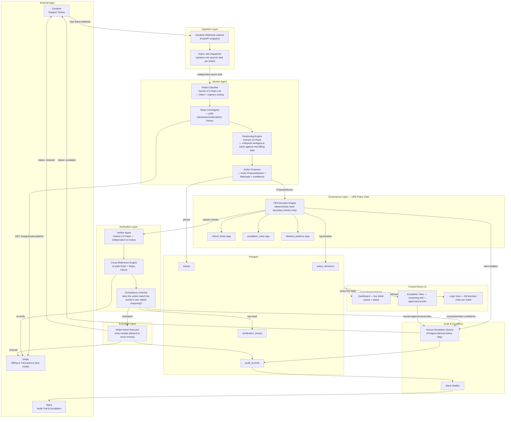
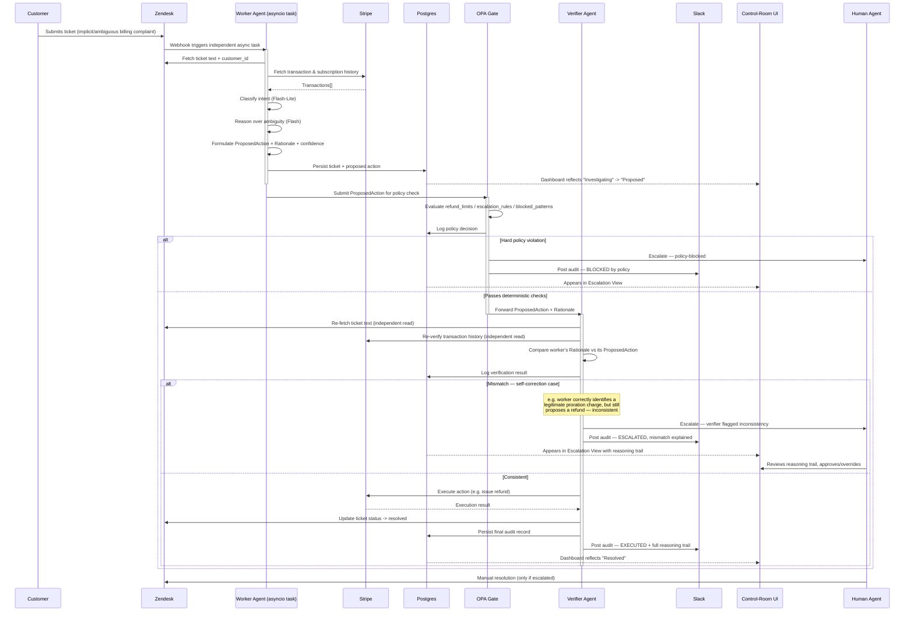
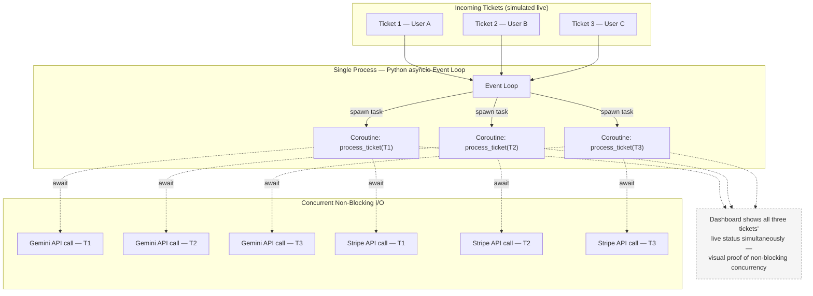
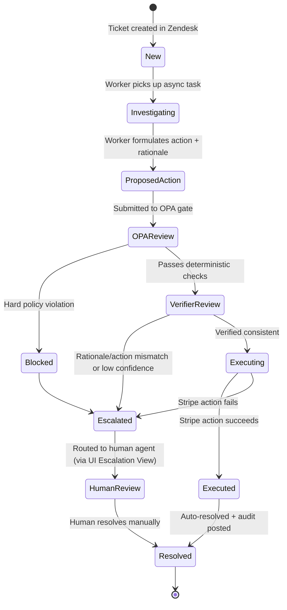
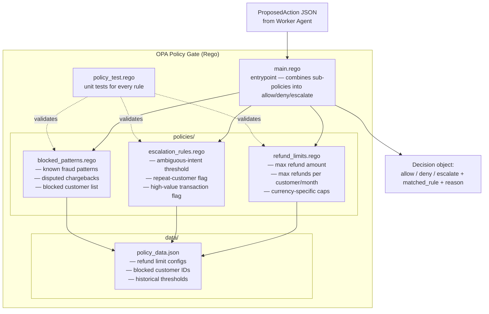
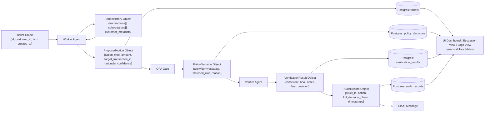
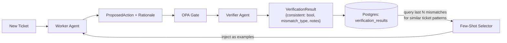

# Architecture — Governed Billing-Support Agent

### Lemma x Comma Capital Multi-App AI Agent Hackathon

Two-agent, OPA-governed billing support system spanning Zendesk, Stripe, and Slack, with a control-room UI for live visibility and human escalation handling. Worker agent proposes an action from ambiguous ticket text + real transaction data; a deterministic policy gate enforces hard boundaries; an independent verifier agent checks the proposed action against the worker's own reasoning before anything executes; all of it is visible and controllable from a dashboard.

**Stack:** Python `asyncio` for concurrency, Postgres for persistence, OPA/Rego for policy, Gemini 2.5 Flash-Lite + Flash for reasoning, a lightweight read-mostly dashboard for the UI layer. No message broker, no cache layer — deliberately lean.

---

## 1. System Architecture



---

## 2. Module Breakdown

### Ingestion

| Module                   | Responsibility                                                                                                                                                                                                |
| ------------------------ | ------------------------------------------------------------------------------------------------------------------------------------------------------------------------------------------------------------- |
| Zendesk Webhook Listener | Receives new/updated ticket events (or polls, if trial-account webhooks are unreliable — verify early)                                                                                                        |
| Async Job Dispatcher     | Spawns an independent `asyncio` task per ticket. This is the entire concurrency guarantee: one ticket's Gemini/Stripe calls never block another's, because each `await` yields control back to the event loop |

### Worker Agent

| Module              | Responsibility                                                                                                                                                                                                               |
| ------------------- | ---------------------------------------------------------------------------------------------------------------------------------------------------------------------------------------------------------------------------- |
| Ticket Classifier   | Fast first pass (Flash-Lite) — filters/routes billing-relevant tickets                                                                                                                                                       |
| Stripe Investigator | Pulls ground-truth transaction and subscription history before any reasoning happens — the worker never reasons from ticket text alone                                                                                       |
| Reasoning Engine    | The actual judgment call (Flash) — reconciles what the customer implied against what actually happened in Stripe, including catching that a charge is legitimate (e.g. proration) even if the customer assumes it's an error |
| Action Proposer     | Packages the decision into a structured, auditable `ProposedAction` object — never executes anything directly                                                                                                                |

### Governance Layer (OPA)

| Module                  | Responsibility                                                                                                                                                                                              |
| ----------------------- | ----------------------------------------------------------------------------------------------------------------------------------------------------------------------------------------------------------- |
| OPA Decision Engine     | Combines sub-policies into a single allow/deny/escalate decision. Deterministic only — no judgment calls live here, that's intentional so the system doesn't collapse into "plumbing with an LLM bolted on" |
| `refund_limits.rego`    | Max refund amount, max refunds per customer/month, currency-specific caps                                                                                                                                   |
| `escalation_rules.rego` | Ambiguous-intent threshold, repeat-customer flag, high-value transaction flag                                                                                                                               |
| `blocked_patterns.rego` | Known fraud patterns, disputed chargebacks, blocked customer list                                                                                                                                           |
| `policy_test.rego`      | Unit tests for every rule, run before the demo to prove the boundaries actually hold                                                                                                                        |

### Verification Layer

| Module                 | Responsibility                                                                                                                                                                                                        |
| ---------------------- | --------------------------------------------------------------------------------------------------------------------------------------------------------------------------------------------------------------------- |
| Verifier Agent         | Independently re-derives the answer — never just re-checks the worker's output, re-reads the raw ticket and raw Stripe data itself                                                                                    |
| Cross-Reference Engine | Re-pulls ticket text + Stripe history + the customer's past ticket pattern                                                                                                                                            |
| Consistency Checker    | The core self-correction mechanism: checks whether the worker's _proposed action_ actually matches the worker's _own stated rationale_. This is what catches the "correctly diagnosed but wrongly acted" failure mode |

### Execution

| Module                 | Responsibility                                                                                                                                    |
| ---------------------- | ------------------------------------------------------------------------------------------------------------------------------------------------- |
| Stripe Action Executor | The only module with permission to actually move money (issue a refund, etc.). Fires only after both OPA and the verifier have cleared the action |

### Persistence (Postgres)

| Table                  | Contents                                                                                                          |
| ---------------------- | ----------------------------------------------------------------------------------------------------------------- |
| `tickets`              | Ticket text, customer_id, proposed action, current status                                                         |
| `policy_decisions`     | Every OPA outcome — allow/deny/escalate, matched rule, reason                                                     |
| `verification_results` | Verifier's consistency check outcome + notes                                                                      |
| `audit_records`        | Full decision chain per ticket, timestamped end to end — this is what makes "auditability" a real, demoable claim |

### Audit & Escalation

| Module                 | Responsibility                                                                                                                                 |
| ---------------------- | ---------------------------------------------------------------------------------------------------------------------------------------------- |
| Slack Notifier         | Posts a human-readable reasoning trail (not a JSON dump) for every outcome — blocked, escalated, or executed                                   |
| Human Escalation Queue | Postgres-backed status flag; a ticket flagged this way is routed back to Zendesk for manual handling, and surfaces in the UI's Escalation View |

### Control-Room UI

| Module          | Responsibility                                                                                                                                                                                                                                                                                                                                                                            |
| --------------- | ----------------------------------------------------------------------------------------------------------------------------------------------------------------------------------------------------------------------------------------------------------------------------------------------------------------------------------------------------------------------------------------- |
| Dashboard       | Live view of the ticket queue — every in-flight and completed ticket, its current state (investigating, pending OPA, pending verification, executed, escalated), and timestamps. Read-mostly, polls or queries Postgres directly — this is also your concurrency proof surface for the demo, since multiple tickets processing in parallel should be visibly true here, not just asserted |
| Escalation View | The one interactive piece: shows the worker's full reasoning, the verifier's flagged inconsistency (if any), and the matched OPA rule (if blocked by policy). Lets a human approve or override a flagged action, which is what actually closes the loop on "human-in-the-loop for genuinely uncertain cases"                                                                              |
| Logs View       | Full decision chain per ticket, end to end, for judges to click through after the live demo — this is what turns your Postgres audit trail from something you describe into something they can inspect themselves                                                                                                                                                                         |

---

## 3. End-to-End Sequence (Single Ticket)



---

## 4. Concurrency Model



Each ticket is its own `asyncio` task. The moment a task hits an `await` on a Gemini or Stripe call, control returns to the event loop, which immediately advances the other tickets. The dashboard is your live proof for this during the demo — three tickets visibly progressing through their states at once, not sequentially.

---

## 5. Ticket Lifecycle — State Diagram



Every state in this diagram is a value the Dashboard and Logs View can query directly off the `tickets` table — no separate state-tracking system needed, Postgres is the single source of truth for both the pipeline and the UI.

---

## 6. OPA Policy Module Structure



---

## 7. Data Flow / Object Model



---

## 8. Repo / Folder Structure

```
billing-agent/
├── docker-compose.yml            # postgres only
├── ingestion/
│   └── zendesk_webhook.py        # FastAPI endpoint, spawns asyncio task per ticket
├── worker_agent/
│   ├── classifier.py             # Gemini Flash-Lite
│   ├── stripe_investigator.py
│   ├── reasoning_engine.py       # Gemini Flash
│   └── action_proposer.py
├── governance/
│   ├── main.rego
│   ├── policies/
│   │   ├── refund_limits.rego
│   │   ├── escalation_rules.rego
│   │   └── blocked_patterns.rego
│   ├── data/policy_data.json
│   └── policy_test.rego
├── verifier_agent/
│   ├── cross_reference.py
│   └── consistency_checker.py
├── execution/
│   └── stripe_executor.py
├── persistence/
│   ├── models.py                 # SQLAlchemy: Ticket, AuditRecord, PolicyDecision, VerificationResult
│   └── db.py                     # Postgres session/engine
├── audit/
│   └── slack_notifier.py
├── ui/
│   ├── app.py                    # dashboard backend — queries Postgres, serves views
│   ├── templates/                # or components/, depending on framework choice
│   │   ├── dashboard.html        # live ticket queue + status
│   │   ├── escalation.html       # reasoning trail + approve/override action
│   │   └── logs.html             # full per-ticket audit trail
│   └── api.py                    # endpoints the frontend polls/queries
├── shared/
│   ├── models.py                 # Pydantic schemas shared across modules
│   └── config.py                 # env vars: DB URL, API keys
└── test_tickets/                 # scripted demo tickets, including the proration trap case

```

**UI build note:** keep this a lightweight, read-mostly dashboard hitting Postgres directly — a simple FastAPI + server-rendered templates (or a minimal frontend framework you're already fast in) is enough. The one genuinely interactive piece is the approve/override action in the Escalation View; everything else can be read-only polling. Don't build real-time websockets unless you already have a fast, reliable way to do it — a few seconds of polling latency is invisible in a live demo and not worth the build risk.

---

## 9. Design Principles Behind the Architecture

- **Judgment stays in the LLM, boundaries stay in OPA.** The policy gate never makes a judgment call — it only enforces hard limits. This avoids the failure mode of looking like deterministic plumbing with an LLM bolted on for classification.
- **The verifier re-derives, it doesn't just re-check.** It re-reads the raw ticket and raw Stripe data independently rather than trusting the worker's summary — this is what makes it catch a genuine reasoning/action mismatch instead of rubber-stamping.
- **Nothing executes until two independent gates clear it.** OPA (deterministic) and the verifier (judgment) both have to pass before Stripe is touched — mirrors the "agents fail silently" thesis by making every step auditable rather than trusting a single agent's output.
- **Concurrency is structural, not incidental.** Async tasks mean the architecture itself demonstrates non-blocking, multi-user handling rather than asserting it in a slide — and the UI makes that structural property visible, not just theoretical.
- **Postgres is the single source of truth for both the pipeline and the UI.** No separate state-tracking system for the dashboard — it reads the exact same tables the agents write to, so what judges see on screen is guaranteed to match what actually happened, not a simulated view.

---

## 10. Self-Improving Loop — Learning From Audit Trail (New)

**What this is not:** live model fine-tuning or weight updates. That's not buildable safely before the demo and would be an easy claim to overclaim badly under judge questioning.

**What this is:** the worker agent gets measurably better across a run because it's fed a small number of its own past verification outcomes as few-shot context, not because it starts from a static prompt every single time.



**How it works, concretely:**

- Every `verification_results` row already captures whether the worker's proposed action was consistent with its own rationale, and if not, what kind of mismatch it was (e.g. "legitimate-charge-but-refund-proposed").
- Before the worker reasons over a new ticket, a lightweight `Few-Shot Selector` queries Postgres for the most similar past tickets that were flagged as mismatches (simple similarity on ticket intent/category is enough — no need for embeddings/vector search given the timeline).
- Those past mismatch cases get injected into the worker's prompt as concrete "don't do this again" examples, alongside their corrected outcome.
- This is genuinely learning from its own run history, not a static prompt — and it's honestly demoable: run the same _type_ of ambiguous ticket twice in the demo, show the worker getting it right the second time because of what the verifier caught the first time.

**Why this framing is safe to pitch:** it doesn't claim model retraining or weight changes, which would invite hard questions you can't answer live. It claims exactly what it is — a feedback loop from your own audit trail back into the next decision — and that's both true and demoable in the time you have.

**Repo/module addition:**

```
worker_agent/
├── few_shot_selector.py      # queries verification_results for similar past mismatches

```

---

## 11. Demo & Pitch Framing (New)

- **Opening line for the pitch:** lead with the mechanism, not the app list — "an agent that's allowed to be wrong, as long as it never acts on being wrong." Say what makes the verifier different before showing any screen: it re-derives independently and catches when the _reasoning_ and the _action_ don't match, not just when the output looks implausible.
- **Two demo tickets minimum, not one:**
  1. A clean ticket that resolves end-to-end with zero human touch — proves the automation half of the pitch works.
  2. The proration-mismatch ticket — worker correctly identifies a legitimate charge but still proposes a refund; verifier catches the inconsistency live. This is the core "disagreement" moment.
  3. _(Stretch, if time allows)_ A second, subtler divergence case where the worker's proposed action looks reasonable on its face, and only the verifier's independent re-pull of Stripe data reveals it's wrong — this reads as a reasoning failure, not a rules failure, and is a rarer, more original-feeling beat than a second policy-style catch.
- **Dashboard as a "disagreement engine," not a status board:** the Escalation View should show the worker's full reasoning and the verifier's independent reasoning side-by-side, with the exact point of divergence visually highlighted — not just a green-check/red-flag outcome. This is the single highest-leverage visual for both Demo Clarity and Reliability & Evaluation scoring.
- **Say the differentiator out loud during judging Q&A if asked about originality:** most verifier patterns check plausibility; this one re-derives from raw data and checks reasoning-to-action consistency specifically — a narrower, harder-to-fake mechanism.
